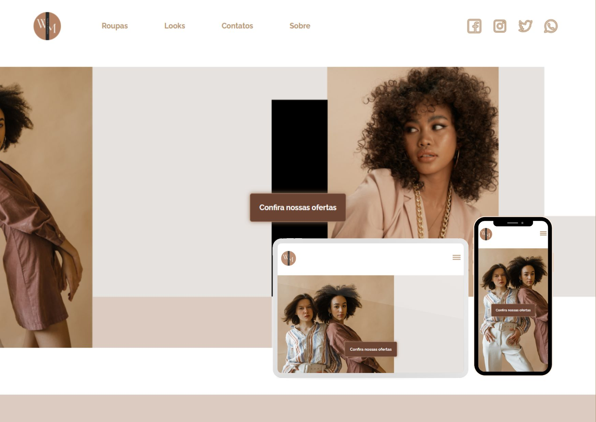

# Poject Woman Fashion  🌐
## Responsive Project

 
🎓 Project made with the academic objective.

<h1> <a href="https://rmarlon.github.io/Woman-Fashion/"> See the site 🖥️ </a></h1>

📱

## Tools used 🛠️

- [HTML5](https://developer.mozilla.org/pt-BR/docs/Web/HTML/Element)
- [CSS3](https://developer.mozilla.org/pt-BR/docs/Web/CSS)
- [Java Script](https://developer.mozilla.org/pt-BR/docs/Web/JavaScript)
